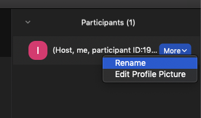

# COMP30022 Workshop 3

- Start at 12:05, please turn cameras on

```txt
It will be helpful to me if you could add your team's name infront of your zoom name.
```



## Tools

|Team Name|Communication Channel|Code Repository|Documentation|Task Management|
--|--|--|--|--|
|AOS|Discord|Github|Confluence + G-drive|clickup|
|AITI|Ms Teams|Github|Ms Teams|Ms Teams|
|Nuggets|Discord|Github|Confluence|Jira|
|Unisoft|Ms Teams|Github|Ms Teams|Trello invite pending|
|Wabby Wabbo|Ms Teams|Github|Ms Teams|Github Projects|

`Any difficulties in setting up tools?`

```txt
igoyal@student.unimelb.edu.au
```

## Client Meeting

- Establish a basic understanding of the problem
- Identify requirements
- Identify the nature of the solution that is desired

Tips -

- Prepare an agenda and brainstorm on questions to ask.
- Nominate a facilitator and meeting minutes taker, good to verify meeting minutes with the client.
- Presenting a motivation model can be useful, your client probably has experience with it.
- With online meetings, keeping a recording of the important meetings can be useful. Ask your client permission to record.

`Any updates from teams regarding client communication/meeting setup`

## User Personas

- Fictional characters which you create based upon your research in order to represent the different user types that might use your service, product, site, or brand in a similar way.
- Include the full range of users.

[User Images](https://thispersondoesnotexist.com/)
[Xtensio](https://xtensio.com/user-persona-template/)
[Uxpressia](https://uxpressia.com/personas-online-tool)

## User Stories

A brief description of the user and their core need

- As a `persona`, I want to `goal`, so that I can `benefit`

```txt
As a user, I want to cancel my hotel booking at any time, 
so that I do not lose money if travel restrictions change.
```

- https://www.atlassian.com/agile/project-management/user-stories 

- https://medium.com/@cog_g/scrum-tips-differences-between-epics-stories-themes-and-features-90f7b6e89610
  
## Standups

|Monday|Team
--|--|
12:00 - 12:15| AITI
12:15 - 12:30| AOS
1:45 - 2:00| Nuggets

|Tuesday|Team
--|--|
3:00 - 3:15|Unisoft
3:15 - 3:30|Wabby Wabbo
